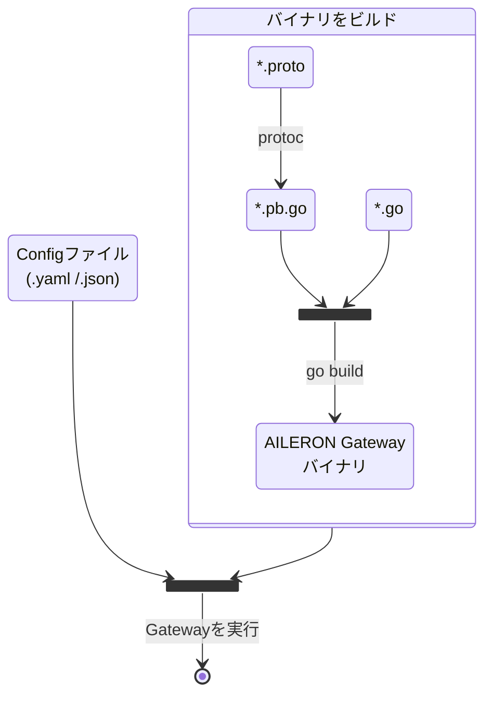

## Overview

このページでは、[AILERON Gateway](https://github.com/aileron-gateway/aileron-gateway) の開発を始める方法について説明します。

必要なツールは以下の通りです：

- [Go](https://go.dev/)
- [protoc - Protocol Buffer](https://protobuf.dev/)
- [GNU make](https://www.gnu.org/software/make/)（オプショナルだが利用を推奨）

以下の図は、AILERON Gateway のビルドと実行の概要を示しています。



## 開発環境のセットアップ

### 1. [Go](https://go.dev/doc/install) をインストール

**手順はこちらを参照してください：[ダウンロードとインストール](https://go.dev/doc/install)**

AILERON Gateway の最新リリースから開発を行う際は、基本的には最新の安定版（`1.(N).x`）または1つ前の安定版（`1.(N-1).x`）を使用してください。  
Go の最低バージョンは [go.mod](https://github.com/aileron-gateway/aileron-gateway/blob/main/go.mod) に記載されています。

インストールが完了したら、`go` コマンドが使用できることを確認してください。  

`go version`コマンドでバージョンを確認できます：

```bash
$ go version
go version go1.24.0 linux/amd64
```

上記に加えて、この時点で `$(go env GOPATH)/bin` を `PATH` 環境変数に追加することを推奨します。  
`$(go env GOPATH)/bin` は、`go install ...` コマンドでインストールされたツールが配置される場所です。

Linux 環境で作業している場合は、以下のコマンドで `PATH` を設定できます：

```bash
PATH=$PATH:$(go env GOPATH)/bin
```

### 2. [Protoc](https://github.com/protocolbuffers/protobuf) をインストール

protoファイルを扱う場合は `protoc` が必要です。  
開発においてprotoファイルを扱わない場合は、このステップをスキップして構いません。

**手順はこちらを参照してください：[Protocol Buffer Compiler のインストール](https://protobuf.dev/installation/)**

AILERON Gatewayは、設定ファイルのインターフェース定義に Protocol Buffer を利用しています。  
protocコマンドにより、protoファイルからGoのコードが生成されます。  
protoファイルは [proto ディレクトリ](https://github.com/aileron-gateway/aileron-gateway/tree/main/proto)にあります。

インストールが完了したら、`protoc` コマンドが使用可能か確認してください。  

`protoc --version`コマンドでバージョンを確認できます：

```bash
$ protoc --version
libprotoc 29.0
```

protocをインストールする際には、公式のprotocリリースにバンドルされている `include/google/`ディレクトリが、適切な場所に配置されている必要があります。

Linux 環境で作業している場合、一般的なディレクトリ構成は以下のようになります：

```txt
/usr/
└── local/
    ├── bin/
    │   └── protoc
    └── include/
        └── google/
```

`/usr/local/include/` は、`protoc` のデフォルトのインクルードパスの1つです。

その他のprotocのデフォルトインクルードパスには、以下が含まれます：

- `<Current>/`
- `<Current>/include/`
- `<Parent>/include/`

これらのいずれかの場所に `google/` ディレクトリを配置してください。

```text
 <Parent>
 ├── <Current>
 │   ├── protoc        <---- Currentはバイナリが存在するフォルダ
 │   ├── google/       <---- デフォルトでインクルードされる
 │   └── include/
 │       └── google/   <---- デフォルトでインクルードされる
 └── include/
     └── google/       <---- デフォルトでインクルードされる
```

詳細は次のファイルを参考にしてください。 [command_line_interface.cc](https://github.com/protocolbuffers/protobuf/blob/0be8c0b8d75964eceba143b82c9a7bafdcbf1e01/src/google/protobuf/compiler/command_line_interface.cc#L256-L296).

### 3. [protoc-gen-go](https://pkg.go.dev/google.golang.org/protobuf) をインストール

`protoc-gen-go` は、protoファイルから Go コードを生成するために必要です。

以下のコマンドでインストールします。

```bash
go install "google.golang.org/protobuf/cmd/protoc-gen-go@latest"
```

インストールが成功したかどうかを確認します。

```bash
$ protoc-gen-go --version
protoc-gen-go v1.36.6
```

`go install ...` コマンドでツールをインストールすると、そのコマンドは `$(go env GOPATH)/bin` に配置されます。  
したがって、このパスが[1. Goをインストール](#1-go-をインストール) で説明したように `PATH` 環境変数に含まれている必要があります。

## AILERON Gateway のビルド

[AILERON Gateway](https://github.com/aileron-gateway/aileron-gateway) をビルドする最も簡単な方法は以下の通りです。

```bash
# AILERON Gatewayのレポジトリルートで作業します。
go build cmd/aileron/
```

または、いくつかの推奨オプションを付けて実行する方法もあります。

```bash
export CGO_ENABLED=0
go build -ldflags="-s -w" cmd/aileron/
```

`go` コマンドを直接実行する代わりに、[Makefile](https://github.com/aileron-gateway/aileron-gateway/blob/main/Makefile) を利用することもできます。

```bash
make build
```
