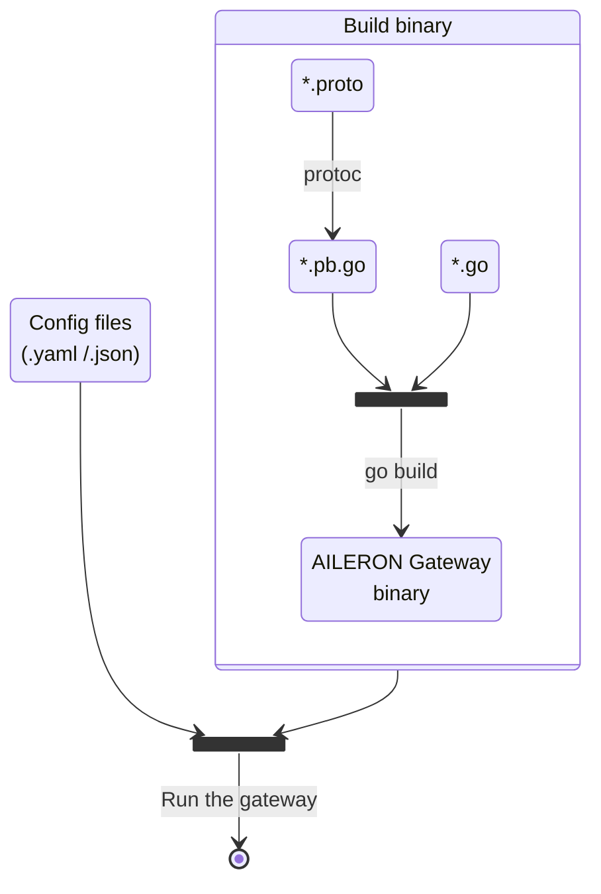

## Overview

This page describes how to get started with developing the [AILERON Gateway](https://github.com/aileron-gateway/aileron-gateway).

This image is the overview of the steps to build and run the AILERON Gateway.

It requires:

- [Go](https://go.dev/)
- [protoc - Protocol Buffer](https://protobuf.dev/)
- [GNU make](https://www.gnu.org/software/make/) (Optional but recommended)



## Setup development environment

### 1. Install [Go](https://go.dev/doc/install)

**Follow the instruction: [Download and install](https://go.dev/doc/install).**

Basicaly use the latest stable (`1.(N).x`) or previous stable (`1.(N-1).x`) version when developing from the main latest AILERON Gateway release.
Minimum requirement of the Go version is declared in the [go.mod](https://github.com/aileron-gateway/aileron-gateway/blob/main/go.mod).

Once installation is completed, make sure `go` command is available.
You can check it by running `go version`.

```bash
$ go version
go version go1.24.0 linux/amd64
```

In addition to above, it is recommended to set `$(go env GOPATH)/bin` to the `PATH` variable at this time.
`$(go env GOPATH)/bin` is the location where tools installed by `go install ....` are located.

If you are working on linux, this command sets the PATH.

```bash
PATH=$PATH:$(go env GOPATH)/bin
```

### 2. Install [Protoc](https://github.com/protocolbuffers/protobuf)

Protoc is required when working with proto files.
If you are not woking with proto files, you can skip this step.

**Follow the instruction: [Protocol Buffer Compiler Installation](https://protobuf.dev/installation/).**

AILERON Gateway leverages protocol buffer to define config file interfaces.
Go codes are generated from proto files using protoc command.
See the [proto directory](https://github.com/aileron-gateway/aileron-gateway/tree/main/proto) for proto files.

Once installation is completed, make sure `protoc` command is available.
You can check it by running `protoc --version`.

```bash
$ protoc --version
libprotoc 29.0
```

When installing the protoc, `include/google/` directory which is bundled to the official protoc release
must be located to the appropriate directory.

If you are working on a linux, typical directory structure should be like this.

```txt
/usr/
└── local/
    ├── bin/
    │   └── protoc
    └── include/
        └── google/
```

Where the `/usr/local/include/` is one of the protoc default include path.

Other protoc default include paths are:

- `<Current>/`
- `<Current>/include/`
- `<Parent>/include/`

You can use one of them to locate the `google/` directory.

```text
 <Parent>
 ├── <Current>
 │   ├── protoc        <---- Current is the binary path
 │   ├── google/       <---- Included by default.
 │   └── include/
 │       └── google/   <---- Included by default.
 └── include/
     └── google/       <---- Included by default.
```

Read more at [command_line_interface.cc](https://github.com/protocolbuffers/protobuf/blob/0be8c0b8d75964eceba143b82c9a7bafdcbf1e01/src/google/protobuf/compiler/command_line_interface.cc#L256-L296).

### 3. Install [protoc-gen-go](https://pkg.go.dev/google.golang.org/protobuf)

`protoc-gen-go` is required to generate Go codes from proto files.

Install it with the command.

```bash
go install "google.golang.org/protobuf/cmd/protoc-gen-go@latest"
```

And check the command was successfully installed.

```bash
$ protoc-gen-go --version
protoc-gen-go v1.36.6
```

Note that the command is installed in the path `$(go env GOPATH)/bin` when tools are installe by the `go install ...` command.
So, the path must be exist in the `PATH` as describe in the [1. Install Go](#1-install-go).

## Build AILERON Gateway

The most simple way to build the [AILERON Gateway](https://github.com/aileron-gateway/aileron-gateway) is

```bash
# Working on the AILERON Gateway repository root.
go build cmd/aileron/
```

or with some recommended options

```bash
export CGO_ENABLED=0
go build -ldflags="-s -w" cmd/aileron/
```

You can use [Makefile](https://github.com/aileron-gateway/aileron-gateway/blob/main/Makefile) instead of running go command directory.

```bash
make build
```
